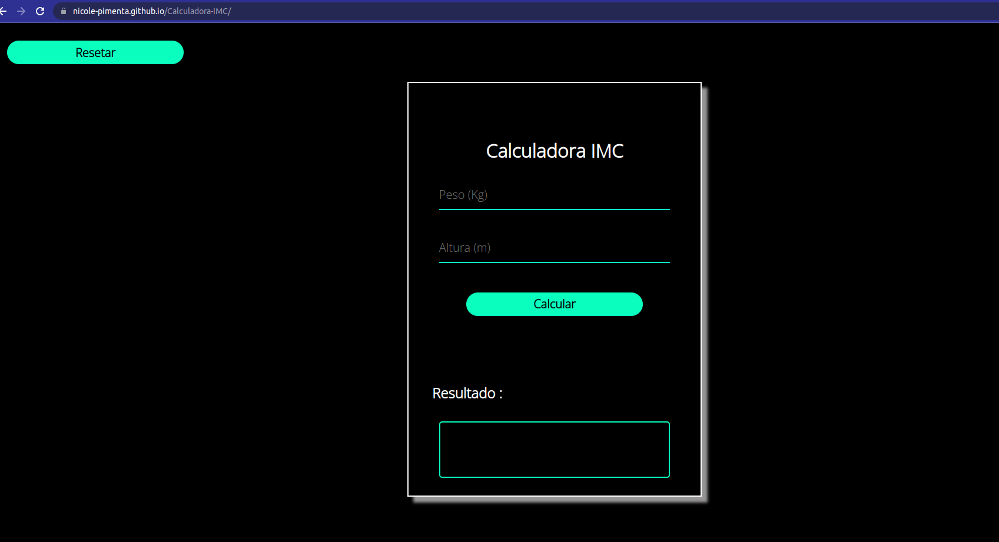

<h1 align="center"> Calculadora IMC</h1>

<div align="center">


</div> <br>

Esse foi um desafio proposto , de nível inicante, pelo curso JSRaiz do Professor Airton Teshima.

# Calculadora IMC

Irei fazer o famoso exemplo da calculadora IMC você podera conferir através da seguinte URL https://nicole-pimenta.github.io/Calculadora-IMC/

## Como funciona

O IMC (Índice de Massa Corporal) é uma ferramenta usada para detectar casos de obesidade ou desnutrição.

Para calcular, você precisa saber a altura (em metros) e peso(em kilos) da pessoa. Com essas informações, você aplica a fórmula e retorna o feedback com base no resultado.

A fórmula é a seguinte:

```
IMC = peso / (altura x altura)
```

Exemplo: Uma pessoa de 1,70m pesando 65kg ficaria da seguinte forma:

```
IMC = 65 / (1.70 x 1.70)
IMC = 65 / 2.89
IMC = 22.49
```

Com base no resultado do IMC, você deve apresentar o feedback em texto conforme o seguinte:

| IMC               | Resultado        |
| ----------------- | ---------------- |
| Menos do que 18,5 | Abaixo do peso   |
| Entre 18,5 e 24,9 | Peso normal      |
| Entre 25 e 29,9   | Sobrepeso        |
| Entre 30 e 34,9   | Obesidade grau 1 |
| Entre 35 e 39,9   | Obesidade grau 2 |
| Mais do que 40    | Obesidade grau 3 |

## Proposta

Focar totalmente na entrega da funcionalidade pensando em JavaScript. Nâo importa o resultado visual.

**Requisitos:**

- Interface para capturar peso e altura
- Botão para clicar e gerar o resultado
- Apresentar na tela o feedback correto (mensagem com base no seu IMC)
